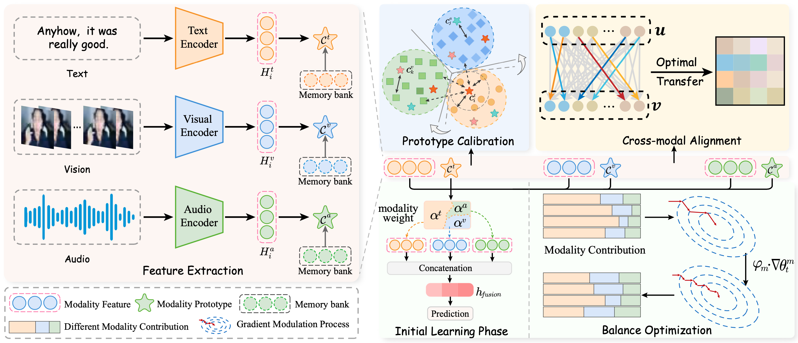

# PaSE
This repository contains the source code for our paper "PaSE: Prototype-aligned Calibration and Shapley-based Equilibrium for Multimodal Sentiment Analysis".


## Introduction



We propose PaSE, a novel **P**rototype-**a**ligned Calibration and **S**hapley-optimized **E**quilibrium framework, which enhances collaboration while explicitly mitigating modality competition. Extensive experiments on IEMOCAP, CMU-MOSI, and CMU-MOSEI confirm that PaSE achieves the superior performance and effectively alleviates modality competition. 


## Usage

### Environment Setup
The project depends on PyTorch, PyTorch Lightning, and Transformers libraries. Create the environment using conda:
```shell
conda create -n PaSE python==3.8.2
conda activate PaSE
```

### Dependency
- Python 3.8.2
- CUDA 11.7
- pytorch ==1.13.1+cu117
- torchvision == 0.14.1+cu117
- numpy == 1.24.3

(see requirements.txt for more details)

### Dataset

We use IEMOCAP, CMU-MOSI and CMU-MOSEI datasets to conduct extensive experiments. To ensure consistency with previous work, we followed the feature preprocessing module in GCNet. 

### Train PaSE

```shell
cd PaSE
sh run_PaSE_xxx.sh
```

